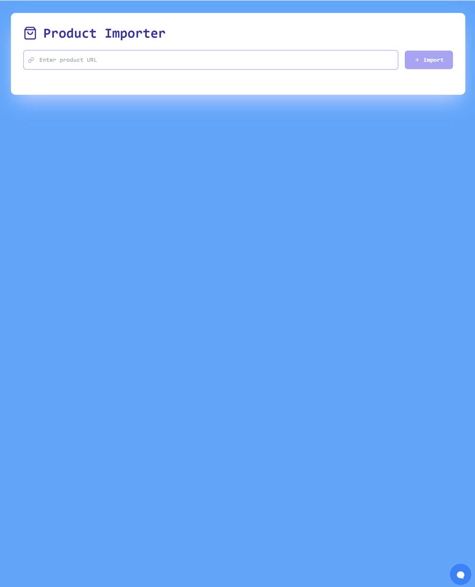
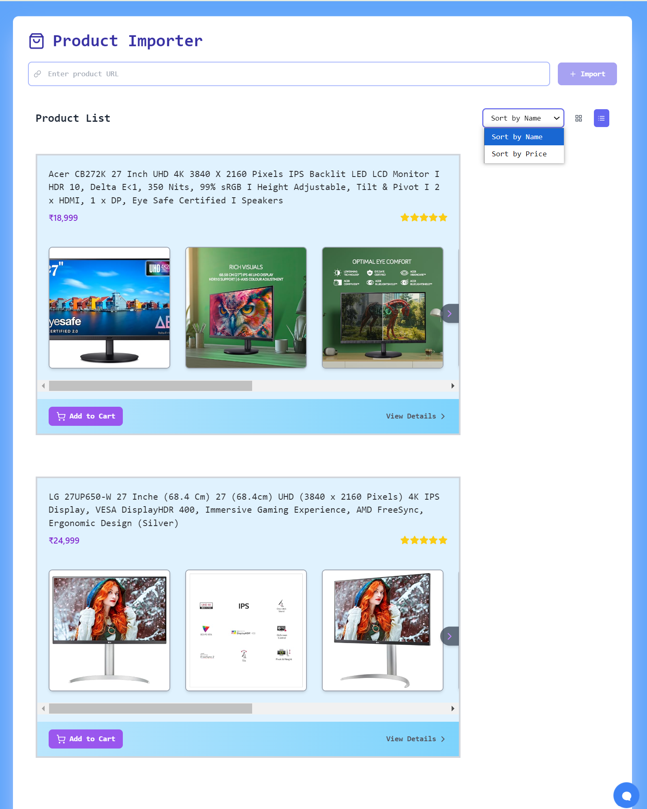
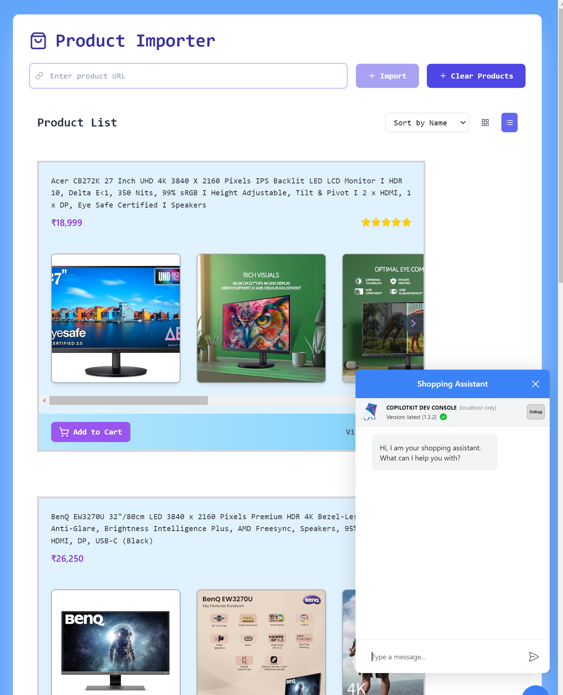

# EcomGenie

EcomGenie is a web application that allows you to import products from various sources and display them on a user-friendly interface.


## UI
- Homepage
  - 
- Filters
  - 
- ChatBot
  - 
  

## Table of Contents

- [EcomGenie](#ecomgenie)
  - [UI](#ui)
  - [Table of Contents](#table-of-contents)
  - [Download](#download)
  - [Environment Variables](#environment-variables)
  - [Setup](#setup)
    - [Backend](#backend)
    - [Frontend](#frontend)
  - [Running the Application](#running-the-application)
  - [Import Products](#import-products)
  - [Contributing](#contributing)
  - [License](#license)

## Download

To get started, download the project repository from the following link:

[Download Repository](https://github.com/triggeredcode/EcomGenie)

## Environment Variables

Before running the application, you need to set up the following environment variables:

- `SCRAPER_API_KEY`: Your Scraper API key.
- `GROQ_API_KEY`: Your Groq API key.

You can set these variables in a `.env` file at the root of the project.

## Setup

### Backend

1. **Navigate to the backend directory:**
   ```sh
   cd backend
   ```

2. **Install dependencies:**
   ```sh
   npm install
   ```

### Frontend

1. **Navigate to the frontend directory:**
   ```sh
   cd frontend
   ```

2. **Install dependencies:**
   ```sh
   npm install
   ```

## Running the Application

1. **Start the backend server:**
   ```sh
   cd backend
   node index.js
   ```

2. **Start the frontend development server:**
   ```sh
   cd frontend
   npm run dev
   ```

3. **Visit the application:**
   Open your web browser and go to `http://localhost:5173` to see the running application.

## Import Products

You can import up to 5 products using the provided interface. Simply add the product details, and they will be displayed on the application, some data is already hardcoded for you, on the right side you will find chatBot to interact with and help you
choose the right product.

## Contributing

Contributions are welcome! Please open an issue or submit a pull request if you find any bugs or have suggestions for improvements.

## License

This project is licensed under the MIT License. See the [LICENSE](LICENSE) file for more details.
